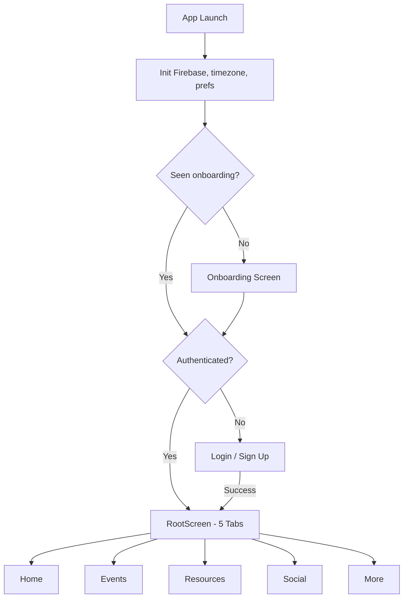
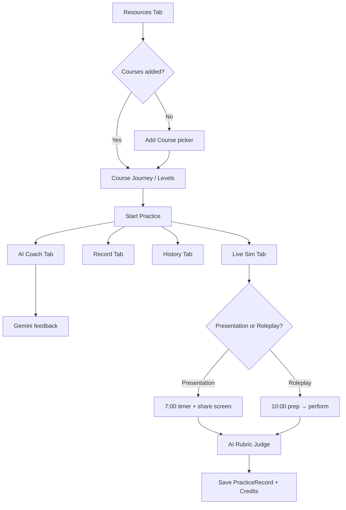
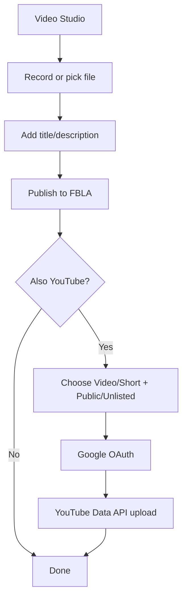
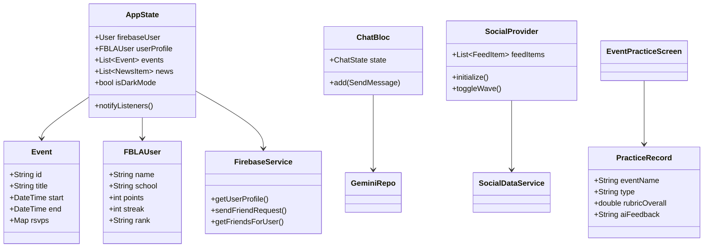
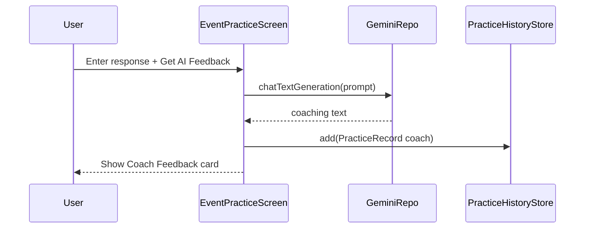
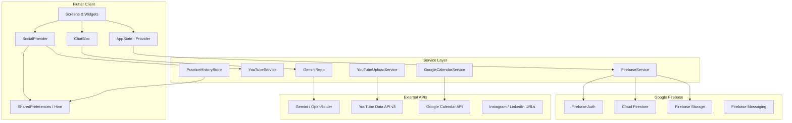

# FBLA Member App — Competition Deliverables Package

**Team:** FBLA 2026 Mobile Application Development  
**App name:** FBLA Member App  
**Platform:** Flutter (Android, iOS, Web, Windows)  
**Backend:** Firebase (Auth, Firestore, Storage, Messaging) + optional AI APIs  

This document consolidates all nine planning/design deliverables for judges and advisers.

**Related assets in repo:**
- Wireframes: [`docs/WIREFRAMES.md`](WIREFRAMES.md) + [`docs/mockups/`](mockups/)
- UML image: [`docs/diagrams/uml.png`](diagrams/uml.png)
- Flowchart image: [`docs/diagrams/flowchart.png`](diagrams/flowchart.png)
- Test plan: [`docs/TEST_PLAN.md`](TEST_PLAN.md)

---

## 1. Requirements Document

### 1.1 Problem statement
FBLA members need a single mobile hub to stay **connected, informed, and competition-ready**. Chapter tools are fragmented across websites, PDFs, social media, and personal calendars. Our app unifies profiles, events, resources, news, social channels, and AI-powered competition prep.

### 1.2 Stakeholders & personas

| Persona | Goals | Pain points |
|--------|--------|-------------|
| **Student member** | Reminders, study resources, NLC prep, social connection | Too many apps; hard to track events and practice |
| **Chapter officer** | Promote events, connect members, share updates | No central member engagement tool |
| **Adviser** | Oversee chapter activity, access official documents | Needs trustworthy, school-appropriate platform |

### 1.3 Functional requirements

| ID | Requirement | Priority | Implementation |
|----|-------------|----------|----------------|
| FR-01 | Email/password and Google sign-in | Must | `login_screen.dart`, Firebase Auth |
| FR-02 | Member profile (school, chapter, competing events) | Must | `edit_profile_screen.dart`, Firestore `users` |
| FR-03 | Events calendar with filters, RSVP, reminders | Must | `EventsScreen`, `flutter_local_notifications` |
| FR-04 | Google Calendar integration for events | Should | `google_calendar_service.dart` |
| FR-05 | FBLA resources: courses, PDFs, document library | Must | `resources_screen.dart`, Syncfusion PDF viewer |
| FR-06 | Cybersecurity guided course (levels, vocab, quizzes) | Must | `resources_screen.dart` (Cybersecurity path) |
| FR-07 | Competition prep: AI Coach, Live Sim, practice history | Must | `event_practice_screen.dart`, `lib/ai/` |
| FR-08 | News feed (chapter/state/national) | Must | `news_feed_screen.dart`, Firestore `news` |
| FR-09 | Social feed: FBLA Social, YouTube, Instagram, forums | Must | `social_screen.dart`, `SocialProvider` |
| FR-10 | Video Studio: publish to FBLA + optional YouTube upload | Should | `video_studio_screen.dart`, YouTube Data API v3 |
| FR-11 | Member directory, friend requests, DMs, group chat | Should | `find_members_screen.dart`, Firestore |
| FR-12 | Gamification: Credits, streaks, rank (Intern → CEO) | Should | `fbla_rank.dart`, `rank_screen.dart` |
| FR-13 | NLC Ready dashboard and prep streaks | Should | `nlc_ready_screen.dart` |
| FR-14 | Accessibility: text size, bold, contrast, read aloud | Should | `accessibility_settings_screen.dart` |
| FR-15 | Settings: dark mode, notifications, help/FAQ | Must | `SettingsScreen`, `faq_screen.dart` |
| FR-16 | Onboarding + first-run feature tour | Should | `onboarding_screen.dart`, `feature_tour.dart` |

### 1.4 Non-functional requirements

| ID | Requirement | How met |
|----|-------------|---------|
| NFR-01 | Usability: core features ≤ 2 taps from Home | 5-tab navigation (`RootScreen`) |
| NFR-02 | Accessibility | Semantics, OS text scaling, custom a11y settings, 44pt targets |
| NFR-03 | Reliability / offline | Cached events & news in `SharedPreferences`; graceful AI fallback |
| NFR-04 | Security | Firestore rules; secrets via `--dart-define`; input validation |
| NFR-05 | Performance | Local caching; lazy-loaded feeds; image caching |
| NFR-06 | Portability | Single Flutter codebase → Android, iOS, Web, Windows |
| NFR-07 | Maintainability | Layered architecture: UI → state → services → Firebase |

### 1.5 Constraints & assumptions
- Firebase config files are added locally (not committed to public repo).
- AI features use Gemini/OpenRouter API keys injected at build time.
- Timezone for reminders defaults to `America/Denver`.
- Internet required for auth, social sync, and live AI; core content cached offline.

### 1.6 Success criteria
- All five prompt inclusions work end-to-end on a physical device.
- A new member can sign up, set a reminder, open a PDF, read news, and view social content in one session.
- Competition prep (AI Coach + Live Sim) produces saved practice history.
- Automated test suite passes (`flutter test`).

---

## 2. User Stories & Use Cases

### 2.1 User stories (sample backlog)

| As a… | I want to… | So that… | Acceptance criteria |
|-------|------------|----------|---------------------|
| New member | create an account with school/chapter | I appear in the directory | Profile saved to Firestore; validation passes |
| Member | RSVP and set a reminder for an event | I don’t miss NLC deadlines | Local notification fires; RSVP persisted |
| Competitor | add Mobile App Dev to my courses | I get tailored prep | Course appears on Resources journey |
| Competitor | run Live Sim with 7-min timer | I practice like NLC | Timer + share-screen controls + AI rubric score |
| Competitor | upload app screenshots to AI Coach | I get UI feedback | Gallery opens; feedback card shown |
| Member | send a friend request | I can message teammates | Request in Firestore; receiver sees in Requests tab |
| Member | post a video to FBLA Social | I share chapter content | Video appears in feed and View Your Posts |
| Member | upload to YouTube (public/unlisted) | Judges see API integration | OAuth + YouTube Data API upload succeeds |
| Member | increase text size in Settings | I can read content easily | App-wide text scale updates immediately |
| Officer | share a Discord announcement | Members see it in-app | Discord hub + outbox flow works |

### 2.2 Use case: Sign up and first session

**Actor:** New student member  
**Precondition:** App installed, network available  
**Main flow:**
1. User opens app → sees Login.
2. User taps Sign Up → enters name, email, strong password, school, chapter, competing events.
3. System validates input → creates Firebase Auth user → writes Firestore profile.
4. User lands on Home → optional feature tour → explores tabs.

**Alternate flows:**
- A1: Google Sign-In → profile merged from Google account.
- A2: Offline signup → credentials queued in `SharedPreferences` until sync.

### 2.3 Use case: Competition practice (Live Sim)

**Actor:** Signed-in competitor  
**Precondition:** Presentation event added to courses (e.g., Mobile Application Development)  
**Main flow:**
1. User opens Resources → selects course → Start Practice → Live Sim tab.
2. User reads scenario → taps Prepare 7:00 Presentation.
3. User uses mute/video/share controls → taps Begin Presentation.
4. Timer counts down 7:00 → user taps Submit to AI Judge.
5. System scores against rubric → saves to practice history → awards Credits.

**Extensions:**
- E1: AI unavailable → bundled demo rubric used silently (judge demo safe).
- E2: User uploads screenshots in AI Coach tab for separate UI review.

### 2.4 Use case: Friend request lifecycle

**Actor:** Member A, Member B  
**Main flow:**
1. A searches directory → sends friend request to B.
2. B sees incoming request → accepts.
3. Friendship document created; both appear in Friends tab.
4. A removes B as friend → friendship deleted; stale request docs cleared.
5. A sends new request → succeeds (no rules error).

---

## 3. System Flowchart

### 3.1 App launch & routing



### 3.2 Resources → Practice flow



### 3.3 Social publish flow



**Exported diagram:** [`docs/diagrams/flowchart.png`](diagrams/flowchart.png)

---

## 4. Pseudocode

### 4.1 Authentication gate

```
FUNCTION main():
    INITIALIZE Firebase, timezone, SharedPreferences
    CREATE AppState(prefs)
    RUN MyApp

FUNCTION AuthGate():
    IF NOT hasSeenOnboarding:
        SHOW OnboardingScreen
    ELSE IF firebaseUser IS NULL:
        SHOW LoginScreen
    ELSE:
        SHOW RootScreen

FUNCTION login(email, password):
    VALIDATE email, password WITH Validators
    TRY firebaseAuth.signIn(email, password)
    LOAD user profile FROM Firestore
    PERSIST session IN SharedPreferences
    CATCH error:
        SHOW AppSnackBar(error)
```

### 4.2 Send friend request

```
FUNCTION sendFriendRequest(fromId, toId):
    REQUIRE auth.uid == fromId
    IF areFriends(fromId, toId): THROW "Already friends"
    outgoingRef = friend_requests/{fromId}_{toId}
    reverseRef = friend_requests/{toId}_{fromId}
    IF outgoing exists AND status == pending: THROW "Already sent"
    IF incoming exists AND status == pending: THROW "Check Requests tab"
    IF outgoing exists AND status != pending: DELETE outgoing
    IF reverse exists AND status != pending: DELETE reverse
    SET outgoingRef { fromUserId, toUserId, status: "pending", ... }
```

### 4.3 Live Sim presentation

```
FUNCTION startLiveSimPresentation():
    phase = PERFORM
    timerSeconds = 420
    presentationTimerRunning = false

FUNCTION beginPresentationTimer():
    IF presentationTimerRunning: RETURN
    presentationTimerRunning = true
    START countdown FROM 420 TO 0

FUNCTION submitForJudging(response):
    IF response empty AND isPresentation:
        response = defaultPresentationSummary
    prompt = buildRubricPrompt(event, scenario, indicators, response)
    TRY result = GeminiRepo.rubricJudge(prompt)
    CATCH: result = NlcDemoMode.bundledRubric(eventName)
    SAVE PracticeRecord(type: live_sim, rubricOverall, rubricJson)
    AWARD 15 credits TO user
    phase = RESULTS
```

### 4.4 Social feed ranking (ML personalization)

```
FUNCTION rankFeedItems(preferences, interactions, items):
    FOR EACH item IN items:
        score = baseScore(item)
        score += platformWeight(preferences, item.platform)
        score += engagementBoost(interactions, item.id)
        score += recencyDecay(item.publishedAt)
    SORT items BY score DESCENDING
    RETURN items

FUNCTION getRecommendedContent(preferences, allContent):
    RETURN top N items BY personalized score
```

### 4.5 YouTube upload

```
FUNCTION uploadVideoToYouTube(file, title, privacy, asShort):
    token = GoogleSignIn(scopes: youtube.upload).getAccessToken()
    IF token IS NULL: THROW "Sign-in cancelled"
    INIT resumable upload session WITH YouTube Data API v3
    STREAM file bytes WITH progress callback
    RETURN { videoId, watchUrl }
```

---

## 5. Wireframes / UI Sketches

High-fidelity SVG mockups live in **`docs/mockups/`**. Summary:

| # | Screen | File | Key elements |
|---|--------|------|--------------|
| 1 | Login | `01-login.svg` | Navy gradient, FBLA logo, gold CTA, Google sign-in |
| 2 | Home | `02-home.svg` | NLC countdown, upcoming events, announcements |
| 3 | Events | `03-events.svg` | Calendar, filters, RSVP, reminder toggle |
| 4 | Resources | `04-resources.svg` | Course levels, progress, document access |
| 5 | AI Coach | `05-ai-coach.svg` | Scenario, response, feedback, practice tabs |
| 6 | Profile / More | `06-profile.svg` | Credits, streak, rank, settings entry |

**Navigation map:**
```
[Bottom Nav]
  Home | Events | Resources | Social | More
```

**Resources course panel:** horizontal course tiles + Add Course → search events → Continue closes panel.

**Social Discover:** Discord, LinkedIn, Video Studio cards; FAB hidden in Discover mode.

Full annotations: [`docs/WIREFRAMES.md`](WIREFRAMES.md)

---

## 6. UML Diagram(s)

### 6.1 Class diagram (core domain)



### 6.2 Sequence: AI Coach feedback



**Exported UML:** [`docs/diagrams/uml.png`](diagrams/uml.png)

---

## 7. System Architecture Diagram



### Layer responsibilities

| Layer | Responsibility |
|-------|----------------|
| **Presentation** | Flutter widgets, navigation, theming, accessibility |
| **State** | `AppState`, `SocialProvider`, `ChatBloc` — reactive UI updates |
| **Services** | Firebase, YouTube, AI, calendar, local persistence |
| **Backend** | Firestore collections, security rules, cloud auth |

---

## 8. Data Structure Plan

### 8.1 Firestore collections

| Collection | Document ID | Fields | Access |
|------------|-------------|--------|--------|
| `users` | `{uid}` | name, email, school, chapter, points, streak, rank, participatingEvents, photoUrl | Read: signed-in; Write: owner |
| `events` | `{eventId}` | title, start, end, location, description, type | Read: signed-in |
| `news` | `{newsId}` | title, body, date | Read: signed-in |
| `competitions` | `{id}` | name, description, leaderboard | Read: signed-in |
| `friend_requests` | `{from}_{to}` | fromUserId, toUserId, status, names, timestamps | Create: sender; Accept: receiver |
| `friendships` | `{sortedUidPair}` | userIds[], createdAt | Create/delete: members |
| `direct_messages` | `{chatId}` | participants | Read/write: signed-in |
| `direct_messages/{id}/messages` | auto | text, senderId, timestamp, sharedPost | Read/write: signed-in |
| `group_chats` | `{groupId}` | name, members | Read/write: signed-in |
| `discord_outbox` | auto | title, body, status, createdBy | Create: signed-in |

### 8.2 Local storage (SharedPreferences / Hive)

| Key / store | Contents |
|-------------|----------|
| `userCourses` | List of competition event names user is preparing for |
| `selectedCourse` | Active course on Resources tab |
| `cyber_completed_levels` | Cybersecurity level progress |
| `cyber_xp` | Course XP cache |
| `savedEvents` | Bookmarked event IDs |
| `cachedEvents` / `cachedNews` | Offline JSON cache |
| `social_bluewave_posts_v1` | User-created FBLA Social posts |
| `practice_history` | Coach / record / live_sim sessions |
| `chat_history_*` | AI chat threads |
| `accessibility_*` | Text scale, bold, contrast, read-aloud flags |

### 8.3 Core Dart models

| Model | File | Purpose |
|-------|------|---------|
| `Event`, `NewsItem`, `FBLAUser` | `fbla_models.dart` | App domain |
| `FBLARankTier` | `fbla_rank.dart` | Intern→CEO progression |
| `PracticeRecord` | `practice_record.dart` | Practice history entries |
| `NlcRubricResult` | `nlc_rubric_result.dart` | Live Sim scoring |
| `BlueWavePostData`, `FeedItem` | `social_models.dart` | Social feed |
| `ChatMessageModel` | `chat_message_model.dart` | AI chat messages |
| `FblaEventOption` | `fbla_events.dart` | Official event catalog |

### 8.4 Rank tiers (Credits thresholds)

| Rank | Credits required |
|------|------------------|
| Intern | 0 |
| Assistant | 100 |
| Coordinator | 250 |
| Specialist | 500 |
| Analyst | 800 |
| Associate | 1,200 |
| Senior Associate | 1,700 |
| Manager | 2,300 |
| Director | 3,000 |
| Vice President | 4,000 |
| President | 5,500 |
| CEO | 7,500 |

---

## 9. Testing Plan & Test Cases

### 9.1 Strategy

| Layer | Method | Tools |
|-------|--------|-------|
| Unit | Pure logic, validators, rank math | `flutter test` |
| Widget | Tap targets, layout probes | `flutter_test` |
| Integration | Auth, Firestore, camera | Manual device checklist |
| Static | Lint / analyze | `flutter analyze` |

Run: `flutter test` (54+ automated tests in `test/`).

### 9.2 Test cases (representative)

#### Authentication

| TC-ID | Test case | Steps | Expected result | Type |
|-------|-----------|-------|-----------------|------|
| AUTH-01 | Valid sign-up | Enter valid email, strong password, profile fields → Submit | Account created; lands on Home | Manual |
| AUTH-02 | Weak password rejected | Enter `password` only | Inline error; submit blocked | Auto (`validators_test`) |
| AUTH-03 | Disposable email rejected | Enter `user@mailinator.com` | Validation error | Auto |
| AUTH-04 | Google sign-in | Tap Google → complete OAuth | Profile loaded | Manual |
| AUTH-05 | Dev/offline login | Use developer bypass (if enabled) | Home without network | Manual |

#### Events

| TC-ID | Test case | Steps | Expected result | Type |
|-------|-----------|-------|-----------------|------|
| EVT-01 | RSVP event | Tap RSVP on event card | RSVP saved; UI updates | Manual |
| EVT-02 | Set reminder | Enable reminder toggle | Local notification scheduled | Manual |
| EVT-03 | Add personal event | Create event with date/time | Appears on calendar | Manual |
| EVT-04 | Google Calendar | Tap add to Google Calendar | Calendar intent opens | Manual |

#### Resources & practice

| TC-ID | Test case | Steps | Expected result | Type |
|-------|-----------|-------|-----------------|------|
| RES-01 | Add course | Add Course → select event → Continue | Course in list; panel closes | Manual |
| RES-02 | Cyber Level 1 | Tap level 1 monitor | Fundamentals lesson opens | Manual |
| RES-03 | AI Coach feedback | Submit response → Get AI Feedback | Feedback card; saved to History | Manual |
| RES-04 | Upload screenshots | Tap Upload App Screenshots → pick image | UI review feedback shown | Manual |
| RES-05 | Live Sim presentation | Prepare → Begin 7:00 → Submit | Rubric score 1–5; Credits awarded | Manual |
| RES-06 | Practice history | Complete session → History tab | Record visible after restart | Auto + manual |

#### Social

| TC-ID | Test case | Steps | Expected result | Type |
|-------|-----------|-------|-----------------|------|
| SOC-01 | Publish video | Record → Publish to FBLA | Post in feed + View Your Posts | Manual |
| SOC-02 | YouTube upload | Enable YouTube → choose public/video → Upload | Video on YouTube channel | Manual |
| SOC-03 | Friend request | Send request → accept on other account | Both show as friends | Manual |
| SOC-04 | Re-request after unfriend | Remove friend → send request again | Request succeeds | Manual |
| SOC-05 | Clear posts | Tap Clear in Video Studio | All user posts removed | Manual |

#### Gamification

| TC-ID | Test case | Steps | Expected result | Type |
|-------|-----------|-------|-----------------|------|
| GAM-01 | Credits award | Complete Live Sim | +15 Credits on profile | Manual |
| GAM-02 | Rank at boundary | Set points to 99 → earn 1 more | Rank becomes Assistant | Auto (`rank_system_test`) |
| GAM-03 | Progress bar | Open Rank screen | Shows % to next tier | Manual |

#### Accessibility

| TC-ID | Test case | Steps | Expected result | Type |
|-------|-----------|-------|-----------------|------|
| A11Y-01 | Text scale | Settings → Accessibility → 150% | App text enlarges | Manual |
| A11Y-02 | Read aloud | Enable read aloud → Speak sample | TTS plays | Manual |
| A11Y-03 | Tap targets | Login screen probe | Controls ≥ 44pt | Auto (`tap_target_probe_test`) |

#### Persistence

| TC-ID | Test case | Steps | Expected result | Type |
|-------|-----------|-------|-----------------|------|
| PER-01 | Chat history round-trip | Save/load chat | Messages restored | Auto |
| PER-02 | Practice history | Add coach record | Newest-first list | Auto |
| PER-03 | Offline cache | Airplane mode → open Home | Cached events/news visible | Manual |

### 9.3 Regression before demo

- [ ] `flutter test` — all green  
- [ ] `flutter analyze` — no errors in `lib/`  
- [ ] Sign-in → Home → each tab loads  
- [ ] Resources Live Sim on Mobile App Dev  
- [ ] Social feed scroll + one publish flow  
- [ ] Friend request send/accept/remove/re-request  

---

## Appendix: File map for judges

| Deliverable | Primary repo location |
|-------------|----------------------|
| Requirements | This doc §1; `docs/PROJECT_PLAN.md` |
| User stories | This doc §2; `docs/PLANNING.md` |
| Flowchart | This doc §3; `docs/diagrams/flowchart.png` |
| Pseudocode | This doc §4; `lib/services/*.dart` |
| Wireframes | `docs/WIREFRAMES.md`, `docs/mockups/*.svg` |
| UML | This doc §6; `docs/diagrams/uml.png` |
| Architecture | This doc §7; `README.md` |
| Data structures | This doc §8; `lib/models/`, `firestore.rules` |
| Testing | This doc §9; `docs/TEST_PLAN.md`, `test/` |

---

*Document generated for FBLA Mobile Application Development presentation. Update version/date before submitting.*
