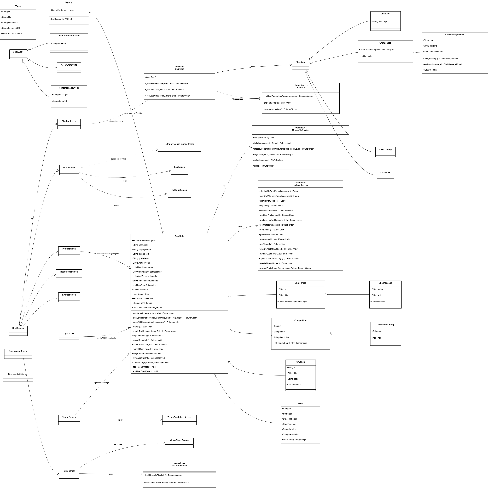

# Planning & Design — FBLA Member App

This document captures the planning process behind the app: the requirements analysis,
information architecture, system design (UML), control flow, user-journey mapping, and
data model. It accompanies the [README](../README.md) and the in-repo source code.

---

## 1. Problem definition

**Topic:** *Design the Future of Member Engagement* — a mobile app that could serve as the
official FBLA member app, helping students stay **connected, informed, and engaged**.

**Required capabilities** (from the competition guidelines): member profiles; an
events/competition calendar with reminders; access to FBLA resources and documents; a news
feed; and integration with chapter social media channels.

**Success criteria.** Each required capability is reachable within two taps of the home
screen, works on a smartphone, and degrades gracefully when the network is unreliable.

---

## 2. Requirements analysis

### Personas
- **Member (student)** — primary user. Wants reminders, resources, news, and a sense of
  progress/recognition.
- **Chapter officer** — additionally manages chapter presence and connects with members.
- **Adviser** — oversight and reference; consumes news and resources.

### Functional requirements
1. Authenticate (email/password or Google) and maintain a profile.
2. Browse a calendar of events/competitions and set reminders.
3. Open FBLA resources and documents (incl. PDFs) and progress through guided courses.
4. Read a filterable news feed (chapter / state / national).
5. View chapter social media inside the app.
6. (Engagement) Practice competitive events with AI feedback; earn coins/streaks/ranks;
   connect with and message other members.

### Non-functional requirements
- **Usability:** intuitive navigation + a first-run guided tour.
- **Accessibility:** screen-reader labels, OS text-scaling support, light/dark themes.
- **Reliability:** offline cache so core content survives a dropped connection.
- **Security:** validated input; secrets injected at build time, never in source.
- **Portability:** Android, iOS, Web, and Windows from one codebase.

---

## 3. Information architecture

Five-tab bottom navigation keeps every required capability one tap from home:

```
Home ── Events ── Resources ── Feeds ── More
 │         │          │          │        └─ Profile, Members, Messaging, Official Hub,
 │         │          │          │           Settings, Help/FAQ, AI Coach
 │         │          │          └─ Videos + News (chapter/state/national), social channels
 │         │          └─ Courses (multi-level), documents, in-app PDF viewer
 │         └─ Calendar (month/week/agenda), filters, RSVP, reminders
 └─ NLC countdown, quick actions, upcoming events, latest updates
```

---

## 4. System design — UML class diagram

`AppState` (a `ChangeNotifier` view model) is the hub: screens read from it via `provider`,
and it delegates persistence to the service layer (`FirebaseService`, `MongoDbService`) and
domain models (`Event`, `NewsItem`, `Competition`, `LeaderboardEntry`, `ChatMessage`, …).
The AI chat feature is factored into its own BLoC + repository.



*Key relationships:* screens → `AppState` (observe/notify); `AppState` → services (CRUD);
services → Firebase/Mongo; `ChatBloc` → `GeminiRepo` (Repository pattern).

---

## 5. Control flow — navigation flowchart

From cold launch the app initializes Firebase + timezones, checks onboarding and auth
state, then routes to the appropriate entry point. Each tab branches into its sub-flows
(decision diamonds = auth/empty-state/permission checks).


```
Launch → init (Firebase, timezone, prefs)
       → seen onboarding?  ── no ─→ Onboarding
       → authenticated?    ── no ─→ Login / Sign-up  →  (validation: syntactic + semantic)
                              yes ─→ Root (5 tabs)
                                       ├─ Home      → event detail / quick actions
                                       ├─ Events    → reminder & RSVP flows
                                       ├─ Resources → course levels / PDF viewer
                                       ├─ Feeds     → news detail / social WebView
                                       └─ More      → profile, members, AI coach, settings
```

---

## 6. User-journey map (new member, first session)

| Stage | User goal | App response | Engagement hook |
|---|---|---|---|
| **Discover** | Understand what the app offers | Onboarding carousel | Clear value proposition |
| **Onboard** | Create an account | Multi-step sign-up with live validation + password-strength meter | Low-friction, guided |
| **Orient** | Learn the layout | First-run guided tour of the 5 tabs | Confidence, fewer dead-ends |
| **Engage** | Find something relevant now | Home: NLC countdown, upcoming events, latest news | Immediate relevance |
| **Act** | Set a reminder / open a resource | One-tap RSVP + local notification; in-app PDF | Habit formation |
| **Return** | Stay engaged over time | Streaks, FBLA coins, rank progression, badges | Gamified retention |

Design rationale: minimize taps-to-value, validate input early to prevent errors, and use
gamification to convert one-time use into recurring engagement — directly serving the
"member engagement" goal of the prompt.

---

## 7. Data model

Domain objects (see `lib/models/` and `AppState` in `lib/main.dart`):

| Entity | Key fields | Persistence |
|---|---|---|
| **FBLAUser / profile** | name, email, school, chapter, role, points, streak, badges, rank | Firestore (`users`) |
| **Event** | id, title, start, end, location, description, rsvps{email→response} | Firestore + offline cache |
| **NewsItem** | id, title, body, date | Firestore + offline cache |
| **Competition** | id, name, description, leaderboard[] | Firestore |
| **LeaderboardEntry** | user, points | embedded in Competition |
| **ChatThread / ChatMessage** | id, author, text, time | Firestore / local |

**Storage strategy.** Firestore is the system of record; `SharedPreferences` holds the
offline cache (events, news) plus lightweight preferences (saved events, dark mode, tour-
seen flag). Profile images use Firebase Storage. Secrets (e.g. `MONGODB_URI`) are injected
via `--dart-define`.

---

## 8. Validation & data integrity

Input validation is centralized in [`lib/utils/validators.dart`](../lib/utils/validators.dart)
and applied at every entry point:

- **Syntactic:** email shape, required fields, confirm-password match.
- **Semantic:** reject disposable email domains and malformed structures; enforce a strong
  password policy (length + character-class mix) with a live strength meter; reject numeric
  names.

---

## 9. Source diagrams

All diagram files live in [`docs/diagrams/`](diagrams/): the editable draw.io
originals (`UML FBLA.drawio.png`, `FBLA Flowchart.drawio.png`) alongside the
exported copies embedded above (`uml.png`, `flowchart.png`).

---

## 10. Related documentation

- [WIREFRAMES.md](WIREFRAMES.md) — high-fidelity UI mockups of every primary screen.
- [DESIGN_SYSTEM.md](DESIGN_SYSTEM.md) — brand colors, typography, components, accessibility tokens.
- [PROJECT_PLAN.md](PROJECT_PLAN.md) — timeline, requirements traceability matrix, risk log.
- [TEST_PLAN.md](TEST_PLAN.md) — testing strategy and the automated suite.
- [README.md](../README.md) — overview, architecture, libraries & copyright.
