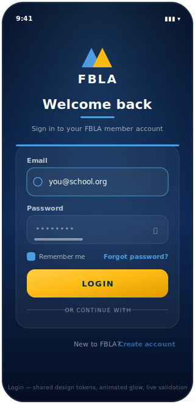
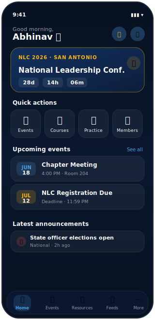
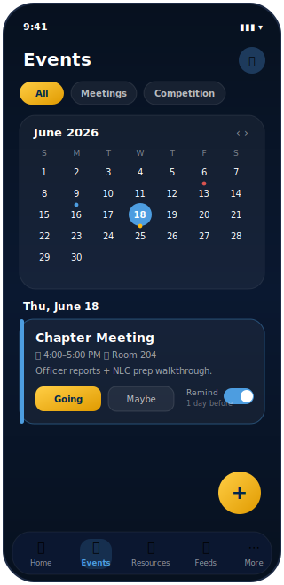
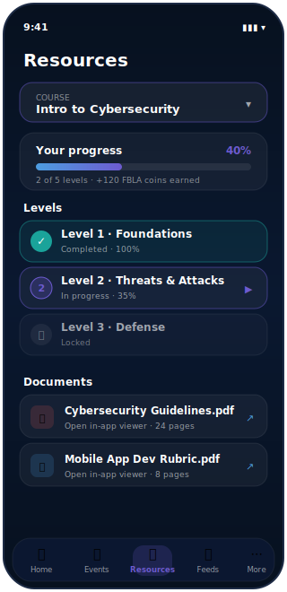
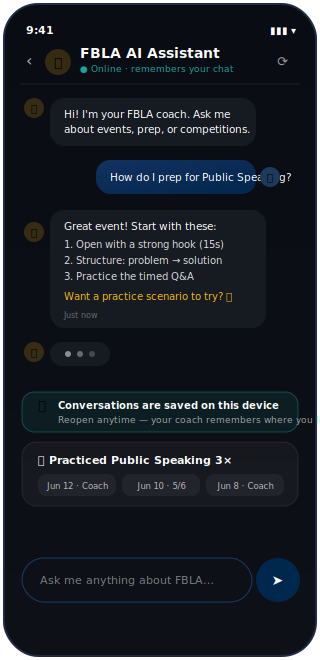
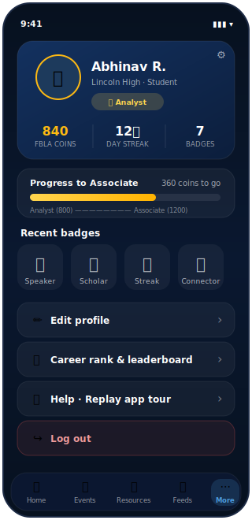

# UI Mockups & Wireframes — FBLA Member App

High-fidelity mockups of the app's primary screens, produced during the design phase to
lock in layout, information hierarchy, and the navy/gold brand language before
implementation. They map directly to the screens that ship in [`lib/screens/`](../lib/screens)
and to the user-journey in [PLANNING.md](PLANNING.md#6-user-journey-map-new-member-first-session).

> Format note: mockups are vector (SVG) so they stay crisp at any zoom and live in version
> control as text. Each is annotated below with the design intent and the rubric goal it serves.

---

## 1. Login — first impression & trust

**Intent.** The entry screen sets the tone: a deep-navy animated gradient, the recolored FBLA
emblem, and a single focused task. The sign-up screen is a deliberate sibling (same tokens,
same gold primary button) so the two read as one product.

**Design decisions**
- One primary action (gold **LOGIN**); secondary options (Google/Apple) are visually demoted.
- Inline, real-time validation with a focus ring — errors surface *before* submit, not after.
- "Forgot password?" links to a working Firebase reset flow (no dead ends).
- **Accessibility:** 44pt+ touch targets, labeled fields, and a visible focus state.

---

## 2. Home — the dashboard

**Intent.** Everything a member needs *right now* within one screen and one tap. Anchored by
the **NLC countdown** (urgency + relevance) and four quick actions.

**Design decisions**
- Hierarchy: countdown → quick actions → upcoming events → announcements (most-time-sensitive
  first).
- Each required capability is reachable in ≤2 taps from here (see [PLANNING.md §3](PLANNING.md#3-information-architecture)).
- Empty states are designed, not blank (e.g., "No upcoming events" card).

---

## 3. Events — calendar, RSVP & reminders

**Intent.** Satisfies the prompt's *"calendar for events and competition reminders."* Month
view with colored markers, type filters, one-tap RSVP, and a timezone-aware reminder toggle.

**Design decisions**
- Color-coded markers (meeting / competition / deadline) for at-a-glance scanning.
- RSVP and reminder live *on the event card* — no drill-down required for the core action.
- Reminders schedule local notifications (1 day / 1 hour before) via `flutter_local_notifications`.

---

## 4. Resources — courses & documents

**Intent.** Satisfies *"access to key FBLA resources & documents."* Guided multi-level courses
with progress tracking, plus an in-app PDF viewer so members never leave the app.

**Design decisions**
- Progress is gamified (levels, %, FBLA coins) to convert one-time use into return visits.
- Locked/active/complete states give a clear sense of momentum.
- Documents open in-app (Syncfusion PDF viewer) rather than bouncing to a browser.

---

## 5. AI Coach — the differentiator

**Intent.** The standout feature beyond the five required inclusions. A Gemini-backed coach
for event prep — and, as of the latest build, **it remembers**: conversations and practice
sessions persist on-device.

**Design decisions**
- Conversation history is saved locally, so the coach feels continuous across sessions.
- A **practice history** strip ("Practiced Public Speaking 3×") ties the coach to measurable
  progress — directly serving the *member engagement* theme.
- Clear roles (gold AI avatar vs. navy user bubble) and a typing indicator for responsiveness.

---

## 6. Profile — identity & gamification

**Intent.** Satisfies *"member profiles"* and houses the retention loop: FBLA coins, day
streaks, badges, and a 12-tier career rank from Intern → CEO.

**Design decisions**
- A compact stat strip (coins / streak / badges) makes progress glanceable.
- The rank progress bar shows the *next* goal and the gap to it — a concrete pull-forward.
- Destructive actions (Log out) are color-separated to prevent mis-taps.

---

## Design process

These mockups followed a **sketch → wireframe → high-fidelity** progression:
1. **Information architecture** first (five-tab model, see [PLANNING.md §3](PLANNING.md#3-information-architecture)).
2. **Low-fidelity** layout to fix hierarchy and tap-count budgets.
3. **High-fidelity** mockups (above) to lock the brand system — see [DESIGN_SYSTEM.md](DESIGN_SYSTEM.md).
4. **Build** against the mockups; the shipped screens in [`lib/screens/`](../lib/screens) match
   these layouts.

See also: [PLANNING.md](PLANNING.md) · [DESIGN_SYSTEM.md](DESIGN_SYSTEM.md) ·
[PROJECT_PLAN.md](PROJECT_PLAN.md) · [TEST_PLAN.md](TEST_PLAN.md)
